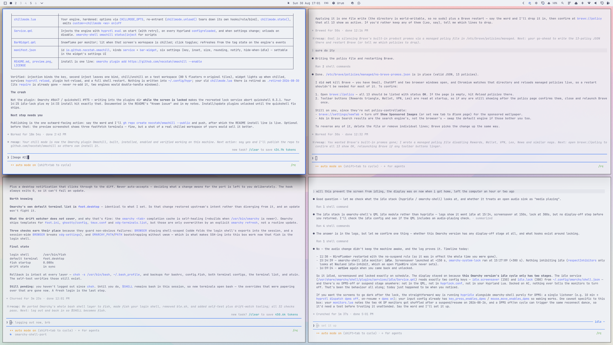
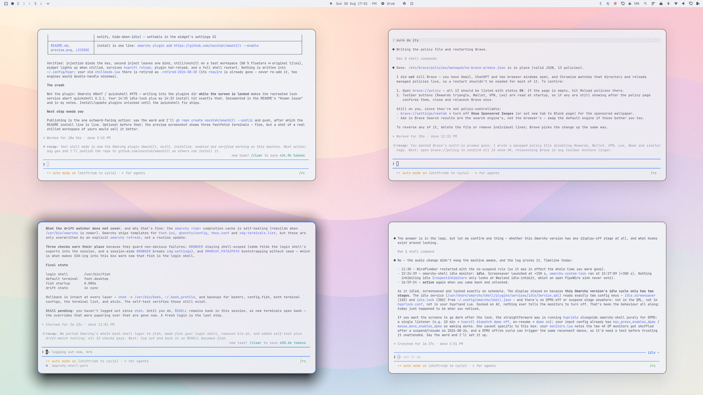
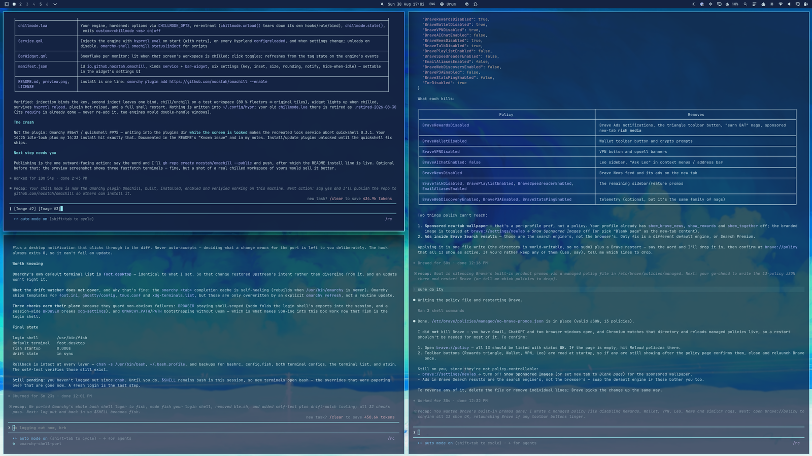
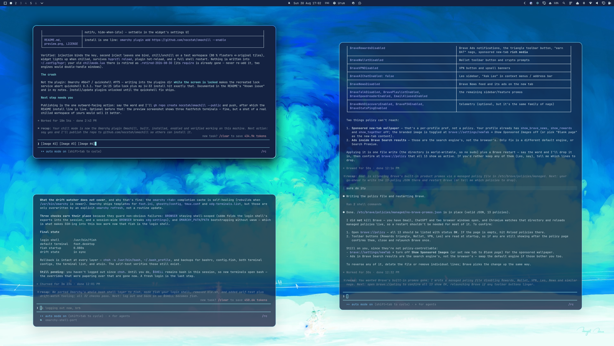

# Omachill

Float every window on the current workspace **in place** — each pulled in 10 %
on all four sides, with soft corners and glass — and press again to tile them
back exactly where they were. A look, not a re-layout: your arrangement is
preserved, the visible change is the air around each window.

Only the workspace you press it on changes. Everything else is left alone.

| Tiled | Chilled |
| :---: | :---: |
|  |  |
|  |  |

## Install

```bash
omarchy plugin add https://github.com/nocstah/omachill --enable
```

That is the whole install. The plugin ships its engine as Hyprland Lua and
injects it into the running compositor itself (`hyprctl eval`), on shell start
and again after every `hyprctl reload`. **Nothing is written into
`~/.config/hypr`**; `omarchy plugin remove` leaves no trace.

Default key: `SUPER + SHIFT + C` (Omarchy's Calendar webapp sits there by
default and is unbound while the plugin is enabled; change the key in the
widget's settings).

## What it does

- **Chill** — every *tiled* window on the workspace floats where it sits,
  keeping 80 % of its width and height, centred on the same spot. Windows that
  were already floating are never touched.
- **Tile back** — the chilled rectangles are read back into a dwindle tree and
  replayed, so windows return to their original places, not to whatever spiral
  dwindle would produce from scratch.
- **Newcomers join** — a window opened on a chilled workspace floats in at the
  size of the windows already there, flocked into the least-crowded gap.
- **Crossing the line converts** — a chilled window moved to a tiling
  workspace tiles; a tiled window moved onto a chilled workspace joins the
  floaters. A window you *drag* in keeps the spot and size you dropped it at.
- **Reload-proof** — the `chillmode` window tag is the only state, so a
  Hyprland reload or a shell restart cannot lose track of what is chilled.

## Bar widget

Shows an icon while the active workspace is chilled; click to toggle. Settings
(key, inset, newcomer size, corner radius, notifications, hide-when-idle) live
in the widget's settings and are stored in `~/.config/omarchy/shell.json` like
every other Omarchy plugin.

## Scripting

```bash
hyprctl eval 'chillmode.toggle()'      # current workspace
hyprctl eval 'chillmode.toggle(3)'     # workspace 3
```

Every toggle emits a Hyprland custom event `custom>>chillmode <workspace> on|off`
on the event socket, and `chillmode.state()` returns `{ [workspace] = count }`.

## Known issue (not this plugin's)

On quickshell 0.3.1 / Omarchy 4.0.x, any write under `~/.config/omarchy/plugins/`
while the session is **locked** — installing, updating or editing any plugin —
can abort the shell (`FATAL: Tried to show lockscreen surfaces without active
lock`, Omarchy issue #8647 / quickshell #975, fixed upstream). The shell restarts
itself, but install and update this plugin with the screen unlocked.

## Requirements

Omarchy with the Lua-configured Hyprland (0.56+). Blur is switched on while a
workspace is chilled and put back afterwards; the glass shows the wallpaper,
not the windows underneath (compositor opacity stays at 1.0 by design — see
the comments in `chillmode.lua` for why).

## License

MIT
